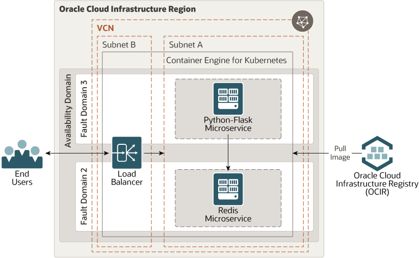

# terraform-oci-arch-microservice-oke

The microservices architecture creates applications as a suite of small services. Each service runs in its own process and communicates with lightweight mechanisms, often an HTTP resource API.

This reference architecture creates Python Flask and Redis microservices and puts them in Docker containers. The microservices are deployed on Oracle Cloud Infrastructure through the Registry and Container Engine for Kubernetes services.

For details of the architecture, see [Deploy microservices to a Kubernetes cluster](https://docs.oracle.com/en/solutions/deploy-microservices/index.html)

## Terraform Provider for Oracle Cloud Infrastructure
The OCI Terraform Provider is now available for automatic download through the Terraform Provider Registry. 
For more information on how to get started view the [documentation](https://www.terraform.io/docs/providers/oci/index.html) 
and [setup guide](https://www.terraform.io/docs/providers/oci/guides/version-3-upgrade.html).

* [Documentation](https://www.terraform.io/docs/providers/oci/index.html)
* [OCI forums](https://cloudcustomerconnect.oracle.com/resources/9c8fa8f96f/summary)
* [Github issues](https://github.com/terraform-providers/terraform-provider-oci/issues)
* [Troubleshooting](https://www.terraform.io/docs/providers/oci/guides/guides/troubleshooting.html)

## Deploy Using Oracle Resource Manager

1. Click [](https://cloud.oracle.com/resourcemanager/stacks/create?region=home&zipUrl=https://github.com/oracle-devrel/terraform-oci-arch-microservice-oke/releases/latest/download/terraform-oci-arch-microservice-oke-stack-latest.zip)

    If you aren't already signed in, when prompted, enter the tenancy and user credentials.

2. Review and accept the terms and conditions.

3. Select the region where you want to deploy the stack.

4. Follow the on-screen prompts and instructions to create the stack.

5. After creating the stack, click **Terraform Actions**, and select **Plan**.

6. Wait for the job to be completed, and review the plan.

    To make any changes, return to the Stack Details page, click **Edit Stack**, and make the required changes. Then, run the **Plan** action again.

7. If no further changes are necessary, return to the Stack Details page, click **Terraform Actions**, and select **Apply**. 

## Deploy Using the Terraform CLI

### Clone the Module

Now, you'll want a local copy of this repo. You can make that with the commands:

    git clone https://github.com/oracle-devrel/terraform-oci-arch-microservice-oke
    cd terraform-oci-arch-microservice-oke
    ls

## Prerequisites
First off, you'll need to do some pre-deploy setup.  That's all detailed [here](https://github.com/cloud-partners/oci-prerequisites).

Secondly, create a `terraform.tfvars` file and populate with the following information:

```
# Authentication
tenancy_ocid         = "<tenancy_ocid>"
user_ocid            = "<user_ocid>"
fingerprint          = "<finger_print>"
private_key_path     = "<pem_private_key_path>"

# Region
region = "<oci_region>"

# Compartment
compartment_ocid = "<compartment_ocid>"

````

Deploy:

    terraform init
    terraform plan
    terraform apply


## Post-Deployment Setup

### Step 1: Configure OCI-CLI

On your local machine terminal, make sure oci-cli is installed using: 

`oci -v`

If not, follow the below link to install and setup OCI-CLI.

`https://docs.cloud.oracle.com/en-us/iaas/Content/API/SDKDocs/cliinstall.htm`

### Step 2: Generate OCIR token

Login to OCI console.

Click on your `Profile` -> `User Settings`. On the bottom left, click on `Auth Tokens`. Click on `Generate Token`.

Provide a discription and then hit `Generate Token`. This will generate a token. Make sure to copy the token and save it for future steps.

### Step 3: Install kubectl and configure kube-config

Install kubectl using below command:

````
curl -LO https://storage.googleapis.com/kubernetes-release/release/`curl -s https://storage.googleapis.com/kubernetes-release/release/stable.txt`/bin/linux/amd64/kubectl;chmod +x ./kubectl;sudo mv ./kubectl /usr/local/bin/kubectl;kubectl version --client
````


Now, to setup kubeconfig, go to your OCI tenancy. On the left hand side click on `Developer Services`. Select `Container Clusters (OKE)`. 
 
Click on the cluster created by terraform earlier.

On the top, click on `Access Kubeconfig` and run the commands specified.

Once done, verify you can access the OKE nodes, by typing:

`kubectl get nodes`

You will see the details of the nodes running on the cluster.

### Step 4: Push the images to OCIR

Lets pull in the image (Flask-Redis app) we want to deploy from docker hub. Make sure you have docker installed and is up and running on your machine.

`docker pull testuser2000/microservice:flask-redis`

Tag the image by adding the details specific to your tenancy.

`docker tag testuser2000/microservice:flask-redis <region-prefix-name>/<your-tenancy-namespace>/customapp:custom`

`<region-prefix-name>` -> eg: iad.ocir.io (for ashburn region)

`<your-tenancy-namespace>` -> (look for namespace in tenancy details on your OCI console for `<your-tenancy-namespace>`)

Lets push the image to OCIR (in ashburn region):

`docker login iad.ocir.io` 

Enter the username and password when asked.

`Username` -> `<your-tenancy-namespace>/oracleidentitycloudservice/<your-oci-user-email-here>` (look for namespace in tenancy details on your OCI console for `<your-tenancy-namespace>`)

`Password` -> OCIR token we had created in Step 2

Push the image as:

`docker push iad.ocir.io/<your-tenancy-namespace>/customapp:custom`

### Step 5: Update kubernetes deployment files

Clone the github repo for kubernetes deployment files as below:

`git clone https://github.com/KartikShrikantHegde/k8s.git`

`cd k8s`

You should see 4 files. Update the `server-deployment.yaml`.

In file `server-deployment.yaml`, go to line 17 and update the image label:

`<region-prefix-name>` - eg: iad.ocir.io (for ashburn region)

`<your-tenancy-namespace>` -> (look for namespace in tenancy details on your OCI console for `<your-tenancy-namespace>`)

Now, lets create a secret for the cluster.

`kubectl create secret docker-registry secret --docker-server=<region-prefix-name> --docker-username='<username>' --docker-password='<ocir-token>' --docker-email='a@b.com'`

`<region-prefix-name>` - eg: iad.ocir.io (for ashburn region)

`<username>` -> `<your-tenancy-namespace>/oracleidentitycloudservice/<your-oci-user-email-here>` (look for namespace in tenancy details on your OCI console for `<your-tenancy-namespace>`)

`<ocir-token>` -> OCIR token we had created in Step 2


Finally, run below commands one after another to apply the configuration to the cluster.

````
kubectl apply -f redis-deployment.yaml
kubectl apply -f redis-cluster-ip-service.yaml
kubectl apply -f server-deployment.yaml
kubectl apply -f server-lb-service.yaml
````

Once applied, wait for 5 mins and then run:

`kubectl get services`

Copy the `EXTERNAL-IP` for the `server-lb-service`.

Run the below command replacing the `EXTERNAL-IP` to issue a PUT request:

`curl -H "Content-Type: application/json" -X PUT -d '{"hello":999}' http://<EXTERNAL-IP>:5000/testurl`

You should receive an output similer to this:

`{ "hello": 999, "last_updated": 1583375217 }`

On making a GET request:

`curl http://<EXTERNAL_IP>:5000/testurl`

You receive a successful response:

`{ "hello": "999", "last_updated": 1583375217 }`

## Destroy the Deployment
When you no longer need the deployment, you can run this command to destroy it:

    terraform destroy

## Microservice Architecture



## Contributing
This project is open source.  Please submit your contributions by forking this repository and submitting a pull request!  Oracle appreciates any contributions that are made by the open source community.

### Attribution & Credits
Initially, this project was created and distributed in [Oracle QuickStart GitHub organization](https://github.com/oracle-quickstart). For that reason, we would like to thank all the involved contributors enlisted below:
- Kartik Hedge (https://github.com/KartikShrikantHegde)
- Lukasz Feldman (https://github.com/lfeldman)

## License
Copyright (c) 2022 Oracle and/or its affiliates.

Licensed under the Universal Permissive License (UPL), Version 1.0.

See [LICENSE](LICENSE) for more details.